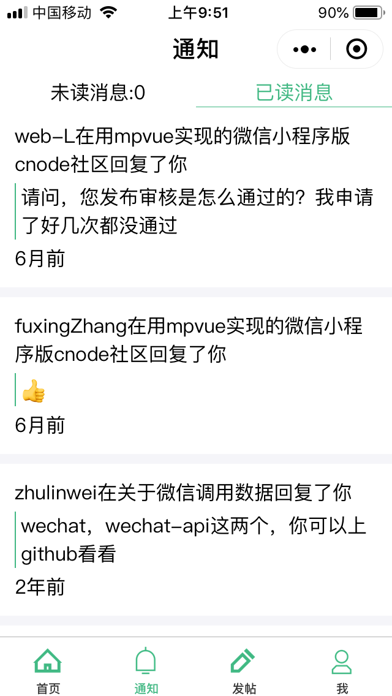
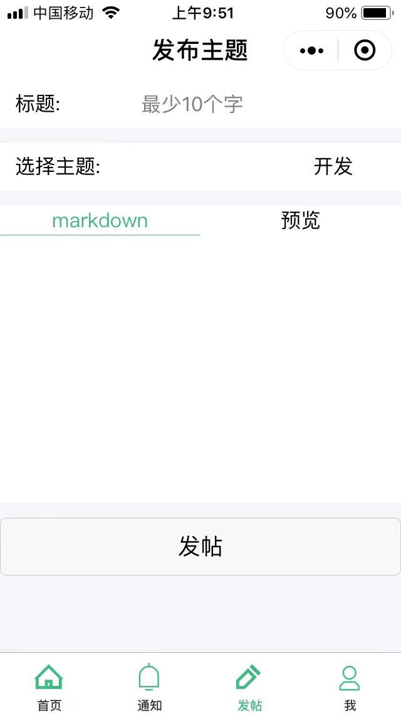
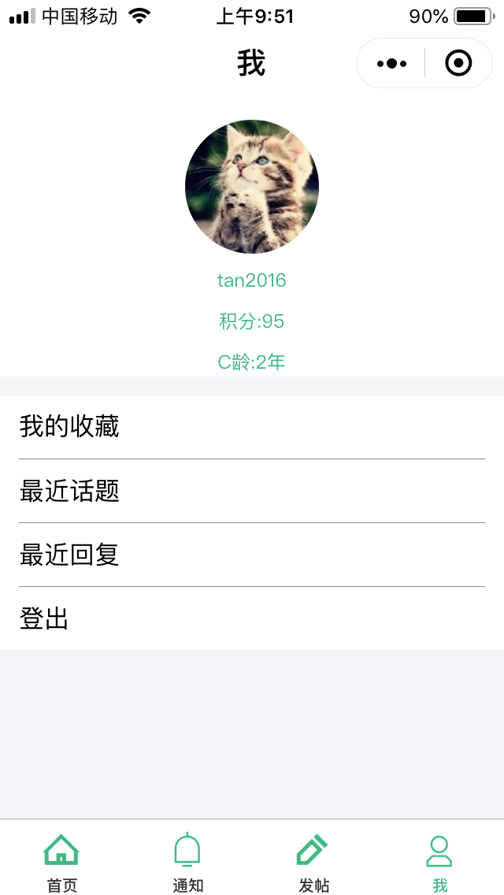
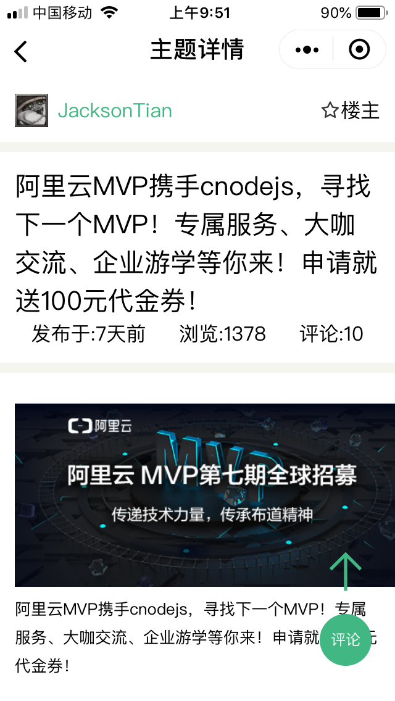

# mpvue-cnode

> 使用mp-vue开发的微信小程序版的cnode。

API来自于[cnode社区](https://cnodejs.org/api)

想熟悉下vue的开发流程，又想体验下mpvue，于是写了个练手项目

线上demo


线上版本更新日志
v0.0.6 修复部分图标路径问题、滚动防抖bug修复

v0.0.5 修复帖子详情滑动卡顿问题 首页栏目切换动画修复 部分图标修复

v0.0.4 修复几处样式，添加帖子热帖，发帖添加markdown预览，通知添加一键已读和点击已读  markdown发布的预览

v0.0.3 添加扫码登陆

v0.0.2  帖子评论框修复、通知点击详情跳转修复

## 预览流程

``` bash
npm install

npm run dev

//使用微信开发者工具打开dist目录，关闭域名和https检查即可
```


目录结构
- src
  - pages
    - index 主页
    - detail 帖子详情页
    - me 我的主页
    - publish 发帖页
    - notice 通知页
    - login 登录页
    - user 用户主页
    - list 帖子列表展示页
  - components
    - card 单一帖子头组件
    - authorHead 作者信息头
    - login 登录组件
    - sendreply 回复、评论组建
  - const.js 常量
  - utils 一些工具函数
- static 静态图片部分

目前已经完成了绝大部分功能，尚未完成的功能在和遇到的问题在todo中

目前存在的问题

小程序无法动态插入dom，markdwon的解析有点问题， [wemark](https://github.com/TooBug/wemark)在mpvue上使用需要改造下。已封装[mpvue-wemark](https://github.com/673800357/mpvue-wemark)解决


todo

  - 编辑自己发过的主题
  - 展示未读消息数和消息已读


优化 
 - 请求失败状态码非200会抛异常，如何统一优雅处理
 - 部分页面添加下拉刷新
 - 到顶部代码不清真。
  
后话：

这个项目没有涉及到太多复杂的部分，主要到是业务逻辑的开发，所有的对于作为一个vue和mpvue小程序入门项目是非常合适的。由于开发时间短，部分代码质量和交互做得不太好。对于未完成的部分和部分未知bug欢迎各位star、提issue、提pr一起来玩2333.

效果图













- License

MIT
